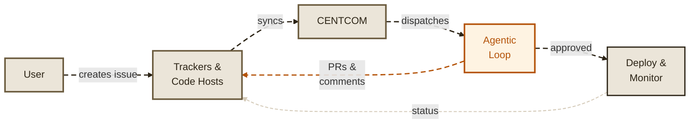
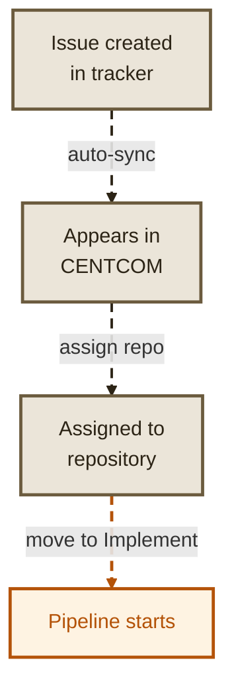
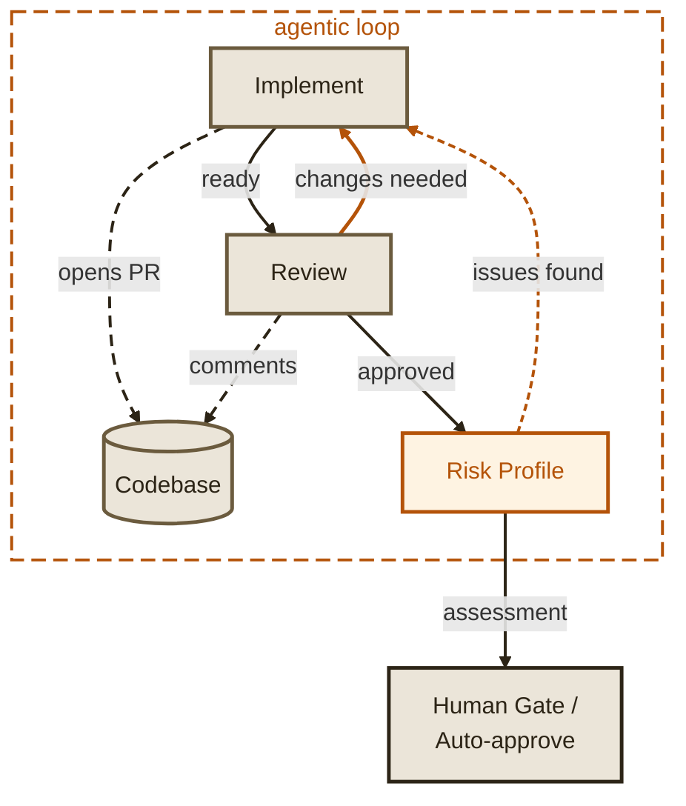
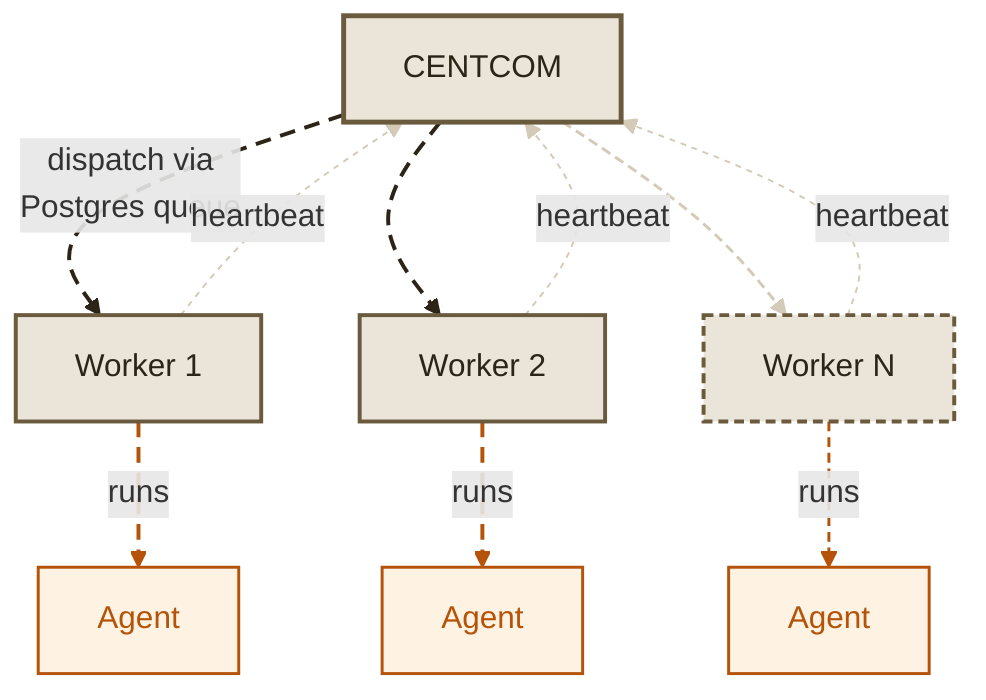
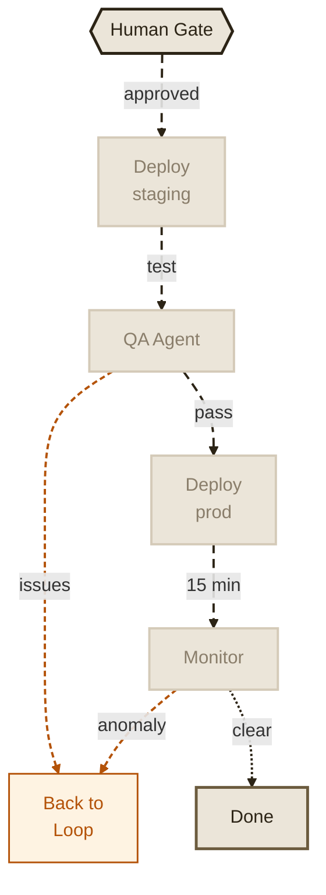

# Concepts

Maestro has a few core components that work together. Understanding how they fit will help you configure and deploy effectively.

*Click any diagram to expand and zoom.*

## System overview

---

## How a task enters the pipeline

---

## The agentic loop

The core of Maestro — agents implement, review, and iterate until the code is ready.

---

## CENTCOM and workers

CENTCOM is the brain. Workers are the muscle. Scale workers horizontally.

---

## Exit: deploy and monitor

After approval, the task exits through deployment and monitoring.

