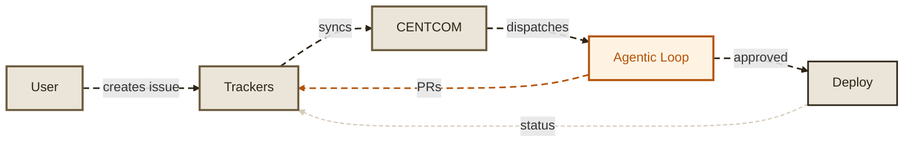
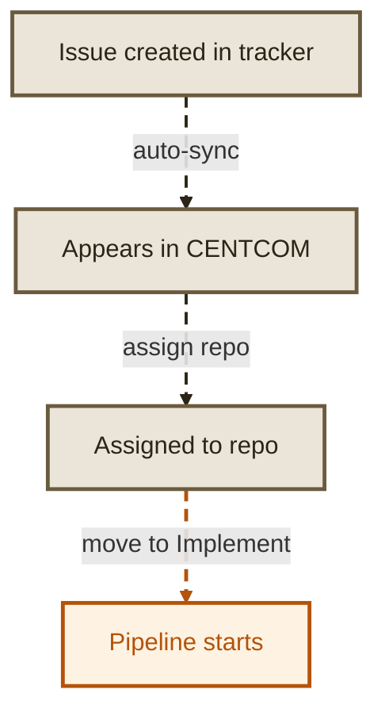
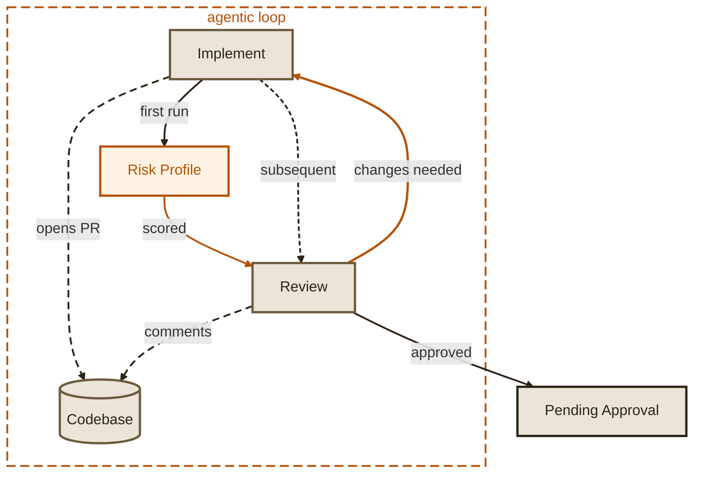
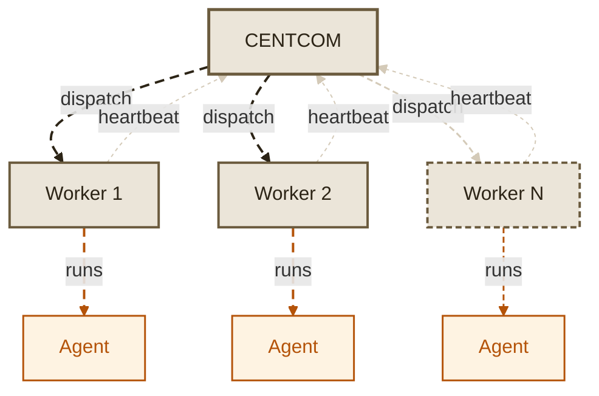
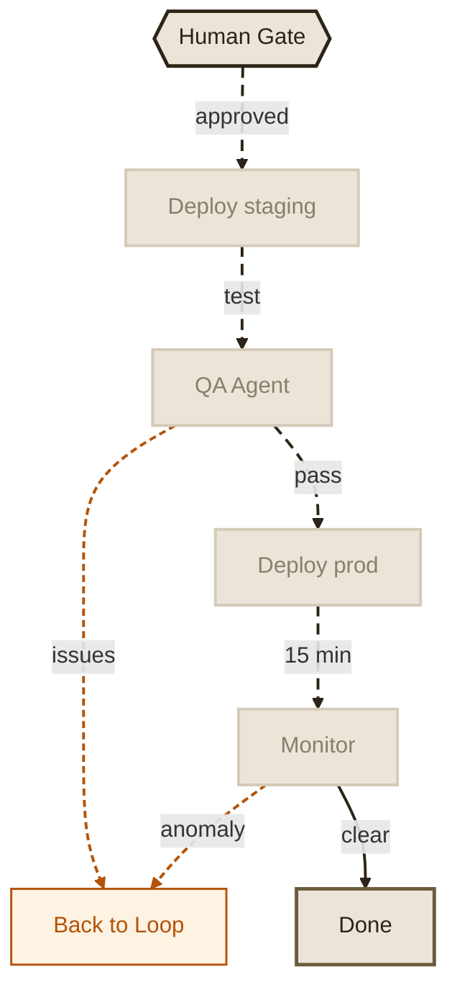

# Concepts

Maestro is built on top of agentic coding systems like Claude Code, Codex, and whatever comes next. These platforms are backed by Anthropic, OpenAI, and others investing billions into making AI agents better at writing code. Maestro doesn't compete with them - it orchestrates them. It provides the pipeline, quality gates, and operational guardrails that turn raw agent capability into reliable engineering output.

This page explains how the major components relate to each other and how work flows through the system - from an issue in your tracker to deployed, monitored code in production.

*Click any diagram to expand and zoom.*

## System overview

At the highest level, Maestro sits between your team and your existing development infrastructure. Users create issues in their tracker of choice. Maestro syncs those issues, runs them through an autonomous agent pipeline that writes code, reviews it, assesses risk, and deploys - then reports status back to the tracker. The entire cycle happens without context switching between tools.

## How a task enters the pipeline

Maestro does not create issues - it consumes them from your existing tracker. When you connect GitHub Issues, Linear, Jira, or GitLab, Maestro continuously syncs open issues and surfaces them on the Tasks page. From there, you assign a target repository and move the task to "Implement" to kick off the agent pipeline. This intentional human trigger ensures agents only work on what you explicitly queue.

## The agentic loop

Once a task enters the pipeline, three agents collaborate. The Implementation Agent writes code and opens a PR. The Risk Profile Agent then scores the change across seven dimensions (runs once). Then the Review Agent reads the diff and posts inline comments - just like a human reviewer. If changes are needed, the Implementation Agent addresses the feedback and pushes new commits, then review runs again (skipping risk profile). This cycle repeats until the Review Agent approves, at which point the task moves to pending approval for the human gate.

## CENTCOM and workers

CENTCOM is the central server - it runs the API, serves the dashboard, and coordinates the orchestrator that dispatches work. Workers are separate processes that pick up jobs from a PostgreSQL queue and execute agents. This separation means you can run one CENTCOM instance and scale workers independently based on throughput needs. Workers can run on the same machine, in separate containers, or on dedicated VMs. Each worker sends heartbeats so CENTCOM knows which workers are alive and how much capacity is available.

## Exit: deploy and monitor

After the agentic loop produces an approved, risk-assessed PR, the task exits through a deployment and monitoring phase. A human gate (or auto-approve for low-risk changes) controls the merge. The Deploy Agent verifies CI checks pass and merges the PR. A QA Agent can optionally validate in staging - if issues are found, the task loops back to the Implementation Agent for fixes. Once deployed to production, the Monitor Agent watches metrics and logs for 15 minutes. If anomalies are detected, it flags the change. If everything is clean, the task is marked done and the tracker is updated.

