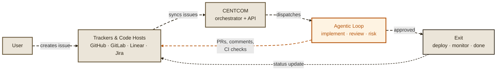
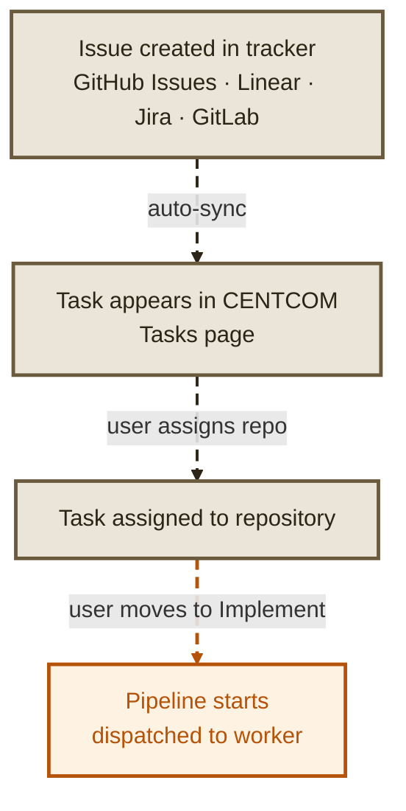
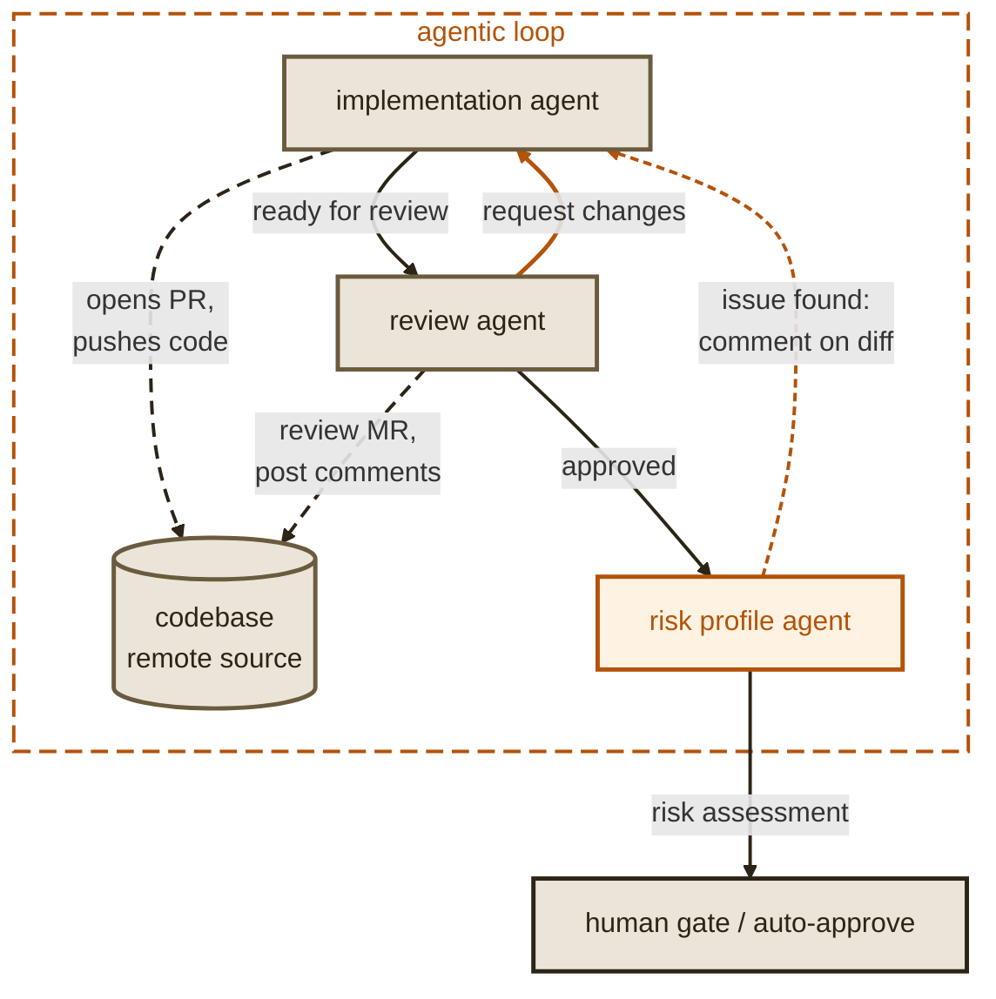
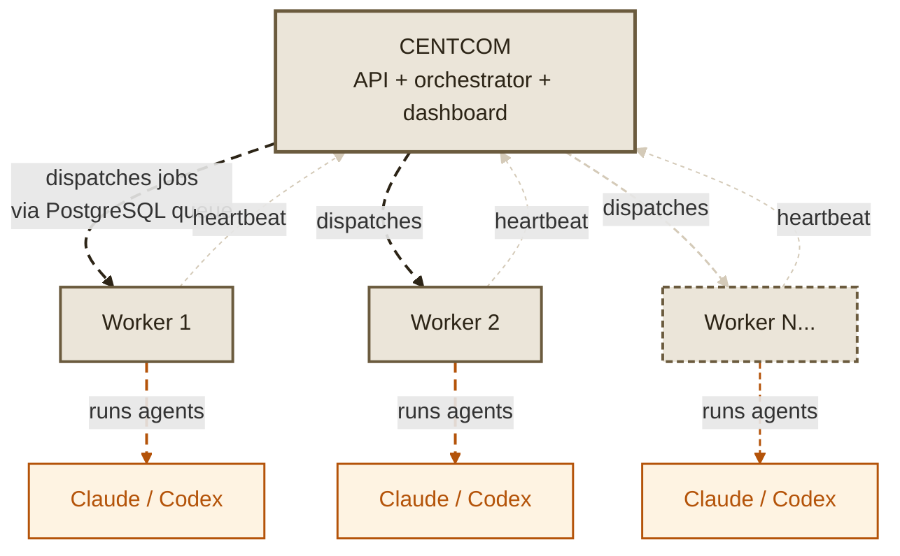
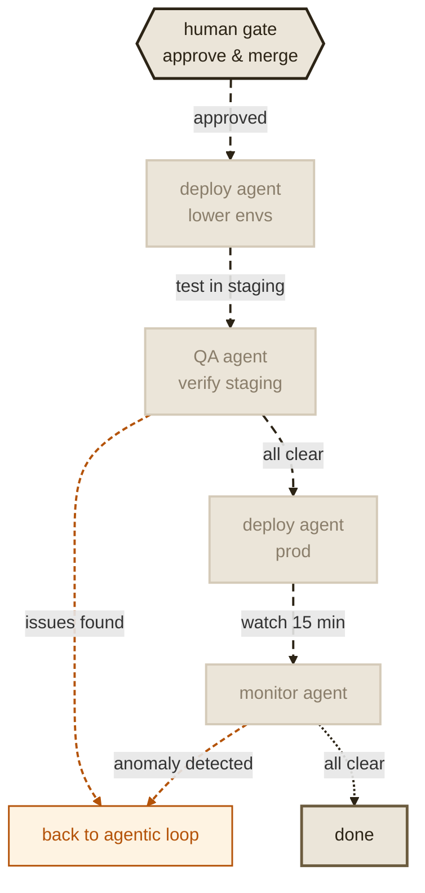

# Concepts

Maestro has a few core components that work together. Understanding how they fit will help you configure and deploy effectively.

## System overview

Five components, one flow:

---

## How a task enters the pipeline

---

## The agentic loop

The core of Maestro — agents implement, review, and iterate until the code is ready.

---

## CENTCOM and workers

CENTCOM is the brain. Workers are the muscle. Workers can be scaled horizontally.

---

## Exit: deploy and monitor

After the agentic loop approves, the task exits through deployment and monitoring.

