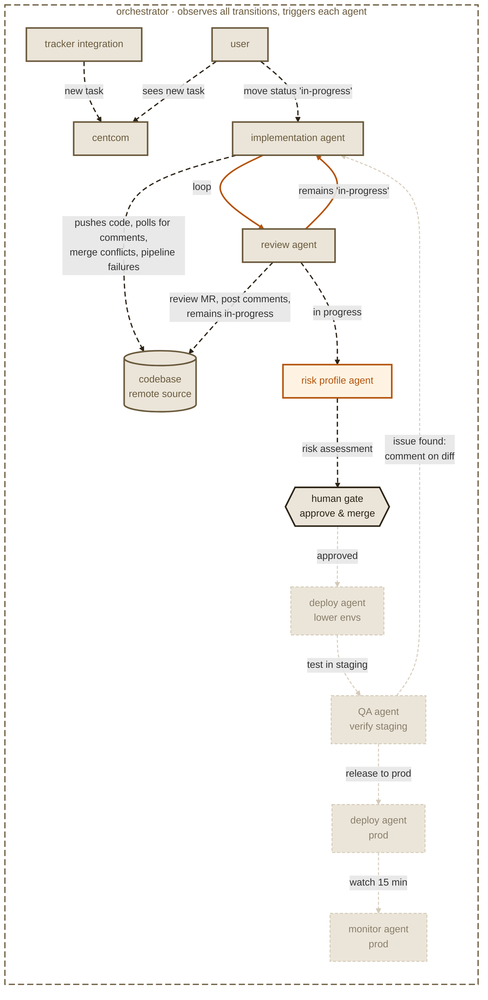

# Concepts

Maestro has a few core components that work together. Understanding how they fit will help you configure and deploy effectively.

```mermaid
graph TB
  subgraph ORCH ["orchestrator · observes all transitions, triggers each agent"]
    direction TB
    TI["tracker integration"] -. "new task" .-> CC["centcom"]
    USR["user"] -. "sees new task" .-> CC
    USR -. "move status 'in-progress'" .-> IA

    IA["implementation agent"] -. "pushes code, polls for comments,<br/>merge conflicts, pipeline failures" .-> CB[("codebase<br/>remote source")]
    IA -- "loop" --> RA
    RA -- "remains 'in-progress'" --> IA
    RA["review agent"] -. "review MR, post comments,<br/>remains in-progress" .-> CB
    RA -. "in progress" .-> RP["risk profile agent"]

    RP -. "risk assessment" .-> HG{{"human gate<br/>approve & merge"}}
    HG -. "approved" .-> DA["deploy agent<br/>lower envs"]
    DA -. "test in staging" .-> QA["QA agent<br/>verify staging"]
    QA -. "issue found:<br/>comment on diff" .-> IA
    QA -. "release to prod" .-> DA2["deploy agent<br/>prod"]
    DA2 -. "watch 15 min" .-> MA["monitor agent<br/>prod"]
  end

  style ORCH fill:none,stroke:#6b5b3e,stroke-width:2px,stroke-dasharray:10 5,color:#6b5b3e
  style TI fill:#ebe5d9,stroke:#6b5b3e,stroke-width:2.5px,color:#6b5b3e
  style CC fill:#ebe5d9,stroke:#6b5b3e,stroke-width:2.5px,color:#6b5b3e
  style USR fill:#ebe5d9,stroke:#6b5b3e,stroke-width:2.5px,color:#6b5b3e
  style IA fill:#ebe5d9,stroke:#6b5b3e,stroke-width:2.5px,color:#6b5b3e
  style CB fill:#ebe5d9,stroke:#6b5b3e,stroke-width:2.5px,color:#6b5b3e
  style RA fill:#ebe5d9,stroke:#6b5b3e,stroke-width:2.5px,color:#6b5b3e
  style RP fill:#fef3e2,stroke:#b45309,stroke-width:2.5px,color:#b45309
  style HG fill:#ebe5d9,stroke:#2c2416,stroke-width:2.5px,color:#2c2416
  style DA fill:#ebe5d9,stroke:#d4cab8,stroke-width:1.5px,color:#8a7e6b,stroke-dasharray:5 3
  style QA fill:#ebe5d9,stroke:#d4cab8,stroke-width:1.5px,color:#8a7e6b,stroke-dasharray:5 3
  style DA2 fill:#ebe5d9,stroke:#d4cab8,stroke-width:1.5px,color:#8a7e6b,stroke-dasharray:5 3
  style MA fill:#ebe5d9,stroke:#d4cab8,stroke-width:1.5px,color:#8a7e6b,stroke-dasharray:5 3

  linkStyle 0 stroke:#2c2416,stroke-width:2px,stroke-dasharray:8 5
  linkStyle 1 stroke:#2c2416,stroke-width:2px,stroke-dasharray:8 5
  linkStyle 2 stroke:#2c2416,stroke-width:2px,stroke-dasharray:8 5
  linkStyle 3 stroke:#2c2416,stroke-width:2px,stroke-dasharray:8 5
  linkStyle 4 stroke:#b45309,stroke-width:2.5px
  linkStyle 5 stroke:#b45309,stroke-width:2.5px
  linkStyle 6 stroke:#2c2416,stroke-width:2px,stroke-dasharray:8 5
  linkStyle 7 stroke:#2c2416,stroke-width:2px,stroke-dasharray:8 5
  linkStyle 8 stroke:#2c2416,stroke-width:2px,stroke-dasharray:8 5
  linkStyle 9 stroke:#d4cab8,stroke-width:1.5px,stroke-dasharray:5 3
  linkStyle 10 stroke:#d4cab8,stroke-width:1.5px,stroke-dasharray:5 3
  linkStyle 11 stroke:#d4cab8,stroke-width:1.5px,stroke-dasharray:5 3
  linkStyle 12 stroke:#d4cab8,stroke-width:1.5px,stroke-dasharray:5 3
  linkStyle 13 stroke:#d4cab8,stroke-width:1.5px,stroke-dasharray:5 3
```
