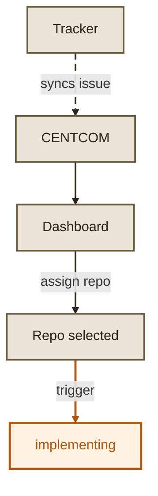
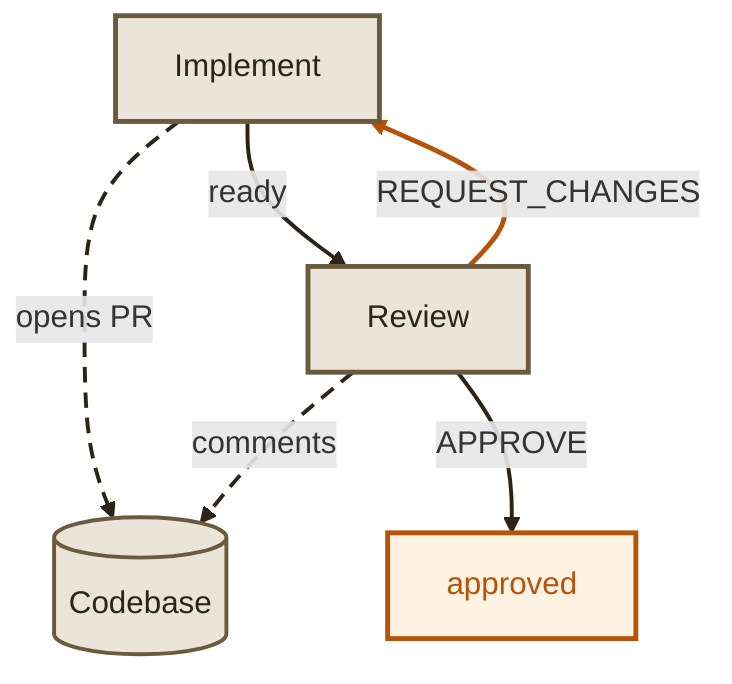
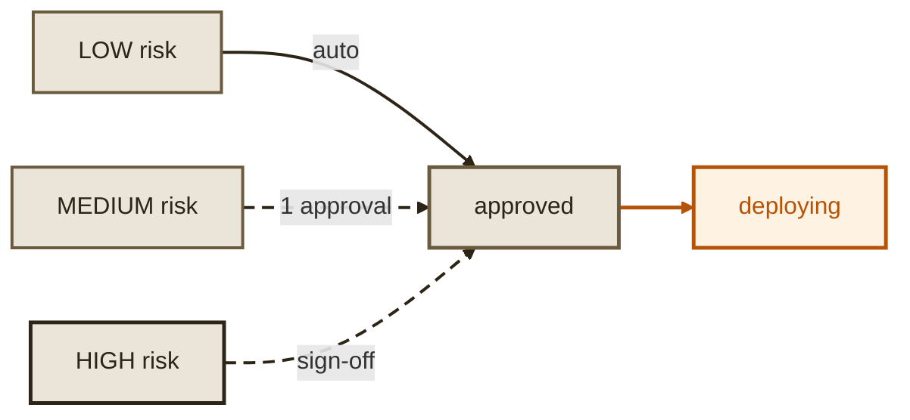
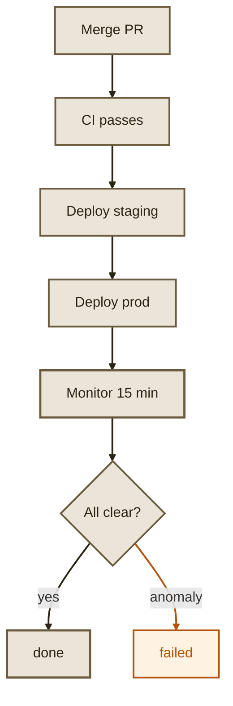

# Lifecycle

Every task in Maestro has a lifecycle. From the moment an issue is synced from your tracker to the moment code is deployed and monitored in production, each stage is handled by a specialized agent with quality gates enforced between them.

```mermaid
graph LR
  TODO["todo"] -.-> IP["in_progress"] -.-> PA["pending_approval"] -.-> APP["approved"] -.-> PRO["promote"] -.-> DEP["deploy"] -.-> DONE["done"]

  style TODO fill:#ebe5d9,stroke:#6b5b3e,stroke-width:2px,color:#2c2416
  style IP fill:#fef3e2,stroke:#b45309,stroke-width:2.5px,color:#b45309
  style PA fill:#ebe5d9,stroke:#2c2416,stroke-width:2.5px,color:#2c2416
  style APP fill:#ebe5d9,stroke:#6b5b3e,stroke-width:2px,color:#2c2416
  style PRO fill:#ebe5d9,stroke:#6b5b3e,stroke-width:2px,color:#2c2416
  style DEP fill:#ebe5d9,stroke:#6b5b3e,stroke-width:2px,color:#2c2416
  style DONE fill:#ebe5d9,stroke:#6b5b3e,stroke-width:2.5px,color:#2c2416
```

| Status | What's happening | Who's responsible | Comment polling |
|---|---|---|---|
| **todo** | Synced from tracker, waiting for user to trigger | User | No |
| **in_progress** | Agentic loop: implement, AI review, AI risk profile | Agents | Yes - saves comments, dispatches if no agent running |
| **pending_approval** | AI work done, waiting for human to review and approve | User | Yes - dispatches agent on new comments |
| **approved** | Human approved, auto-merge and deploy to lower envs | System | No |
| **promote** | Lower envs healthy, promoting to production | System | No |
| **deploy** | Deploying to prod, monitoring | Agents | No |
| **done** | Complete, monitoring passed | - | No |
| **failed** | Error at any stage - can be retried | Needs attention | No |
| **halted** | User manually stopped - can be resumed | User | No |

Statuses from `approved` through `deploy` are not yet implemented. Tasks currently stop at `pending_approval` and require manual progression.

## 1. todo

A task begins its lifecycle when an issue is created in your connected tracker (GitHub Issues, Linear, Jira, or GitLab). Maestro polls the tracker on a configurable interval and syncs new issues to the Tasks page. At this point the task exists in Maestro but no agent has touched it.

- Issue title, description, priority, and labels are synced
- Task appears on the dashboard with status `todo`
- No repository is assigned yet

A human assigns a target repository and moves the task to **implementing**. This is the intentional trigger that starts the agent pipeline. Maestro will not autonomously pick up tasks without this step.

## 2. implementing

The Implementation Agent clones the repository, reads the codebase to understand conventions, writes the code, runs the test suite, and opens a pull request.

- Reads the task description and any `.agents/` context files in the repo
- Explores project structure, patterns, and dependencies
- Writes the implementation across new and modified files
- Runs existing tests to verify nothing is broken
- Creates a `maestro/*` branch and opens a PR on the code host
- Attaches the PR link to the task

## 3. in-review

The Review Agent checks out the PR and performs inline code review, posting comments on specific lines via the code host API. The Risk Profile Agent also runs during this stage, scoring the change across seven dimensions.

- Reads every changed file in full context
- Posts inline comments categorized as bug, style, performance, security, or suggestion
- Issues a verdict: **APPROVE** or **REQUEST_CHANGES**
- Risk Profile Agent scores scope, blast radius, complexity, test coverage, security, reversibility, dependencies

If changes are requested, the task cycles back to **implementing**. This is the core feedback loop that ensures code quality before anything gets merged.

This loop has a configurable maximum iteration count (default: 5) to prevent infinite cycles.

## 4. approved

All gates have passed: AI review approved, risk assessed, human signed off (for medium/high risk). The system auto-merges the PR if a human hasn't merged it already. Low risk changes reach this state automatically. Medium and high risk changes require explicit human approval first.

## 5. deploying

The Deployment Agent merges the PR (if not already merged), verifies CI, deploys to lower environments, and promotes to production. The Monitor Agent then watches metrics and logs for 15 minutes post-deploy.

- Checks all CI pipelines (build, lint, test, deploy-preview)
- Waits for all checks to pass
- Merges the PR via squash into the target branch
- Deploys to staging and runs validation
- Promotes to production
- Monitor Agent watches for regressions for 15 minutes

## 6. done

The monitoring window passed clean. Code is in production, the tracker is updated, and the task is complete.

## failed and blocked

At any point during its lifecycle, a task can leave the happy path:

| State | What happened | What to do |
|---|---|---|
| **failed** | Agent error, test failure, CI failure, unrecoverable issue | Check logs in task detail, fix the issue, re-trigger |
| **blocked** | High-risk PR needs sign-off, merge conflict, manual intervention needed | Review the PR, resolve conflicts, approve or reject |

All state transitions are logged in the task activity feed and visible in real time on the dashboard.
