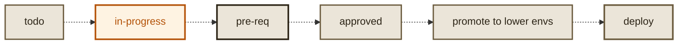
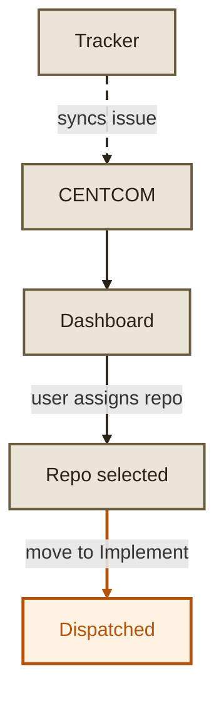
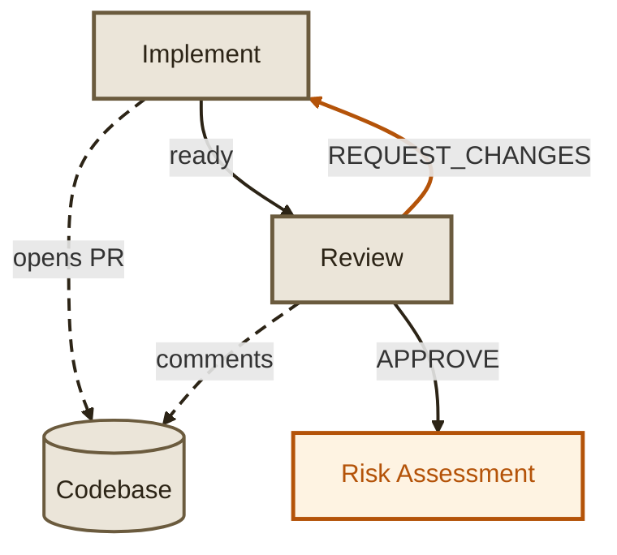
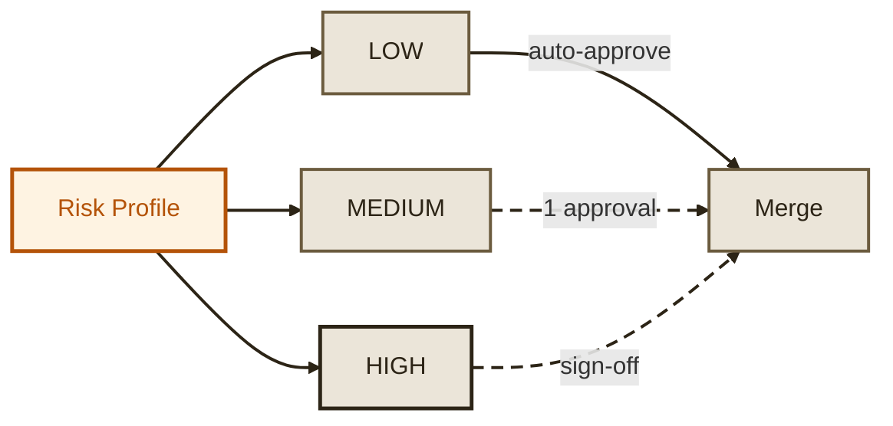
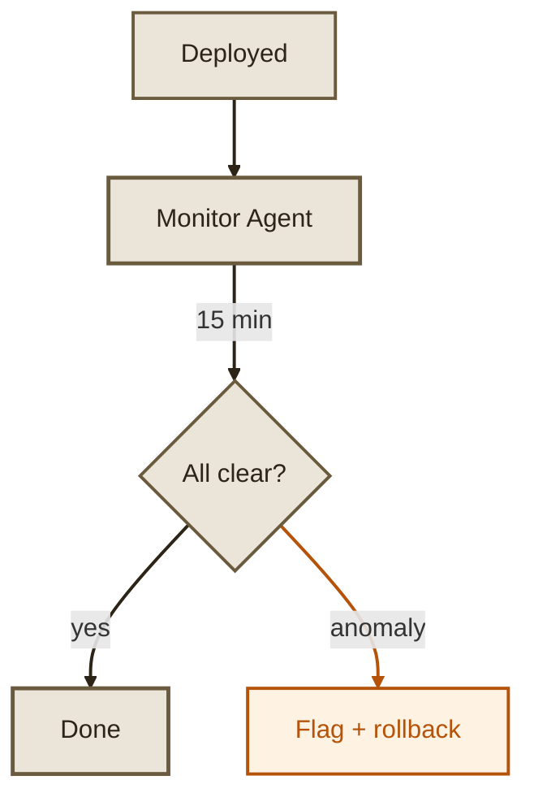

# Lifecycle

Every task in Maestro has a lifecycle. From the moment an issue is synced from your tracker to the moment code is deployed and monitored in production, each stage is handled by a specialized agent with quality gates enforced between them.

| Status | What happens |
|---|---|
| **todo** | Task is synced from tracker, not triggered to run |
| **in-progress** | Implementation agent writes code, AI/human/tool review, AI risk profile |
| **pre-req** | All review comments resolved, human gate: approved by human |
| **approved** | Auto-merged if not already merged by human, deploy and monitor lower envs |
| **promote to lower envs** | Deploy to staging, QA validation (future: automated QA agent) |
| **deploy** | Merged, deploying and monitoring to production |

## 1. Issue synced

A task begins its lifecycle when an issue is created in your connected tracker (GitHub Issues, Linear, Jira, or GitLab). Maestro polls the tracker on a configurable interval and syncs new issues to the Tasks page. At this point the task exists in Maestro but no agent has touched it.

- Issue title, description, priority, and labels are synced
- Task appears on the dashboard with status `queued`
- No repository is assigned yet

## 2. Assigned and triggered

A human assigns a target repository to the task and moves it to **Implement**. This is the intentional trigger that starts the agent pipeline. Maestro will not autonomously pick up tasks without this step.

## 3. Implementation

The Implementation Agent clones the repository, reads the codebase to understand conventions, writes the code, runs the test suite, and opens a pull request.

- Reads the task description and any `.agents/` context files in the repo
- Explores project structure, patterns, and dependencies
- Writes the implementation across new and modified files
- Runs existing tests to verify nothing is broken
- Creates a `maestro/*` branch and opens a PR on the code host
- Attaches the PR link to the task

## 4. Review

The Review Agent checks out the PR and performs inline code review, posting comments on specific lines via the code host API.

- Reads every changed file in full context
- Posts inline comments categorized as bug, style, performance, security, or suggestion
- Issues a verdict: **APPROVE** or **REQUEST_CHANGES**

If changes are requested, the task cycles back to the Implementation Agent. This is the core feedback loop that ensures code quality before anything gets merged.

This loop has a configurable maximum iteration count (default: 5) to prevent infinite cycles.

## 5. Risk assessment

After review approval, the Risk Profile Agent scores the change across seven dimensions.

| Dimension | What it measures |
|---|---|
| Scope | Files and lines changed |
| Blast radius | Systems and users affected |
| Complexity | Cyclomatic complexity, new abstractions |
| Test coverage | Whether tests exist for changed paths |
| Security | Auth, crypto, PII, secrets handling |
| Reversibility | Can this be rolled back cleanly? |
| Dependencies | New or updated external packages |

Each dimension is scored 1-5. The overall risk level determines what happens next:

If the Risk Profile Agent finds issues in the diff, it can send the task back to the Implementation Agent for fixes before proceeding.

## 6. Human gate

For medium and high risk changes, a human reviews the risk assessment and the PR before approving the merge. This is the final quality gate before code enters the deployment path. Low risk changes skip this step entirely.

## 7. Deployment

The Deployment Agent handles merging and CI verification.

- Checks all CI pipelines (build, lint, test, deploy-preview)
- Waits for all checks to pass
- Merges the PR via squash into the target branch
- Optionally deploys to staging for QA verification before production

If a QA Agent is configured, it validates in staging. Issues found loop back to the Implementation Agent. Once staging is clean, the Deployment Agent promotes to production.

## 8. Monitoring

The Monitor Agent watches for post-deploy regressions in production.

- Queries metrics dashboards for latency and error rate changes
- Checks logs for new exceptions
- Monitors for 15 minutes after deploy
- Flags the task if anomalies are detected, which can trigger a rollback or loop back for fixes

If the monitoring window passes clean, the task is marked **done** and the tracker is updated.

## Terminal states

At any point during its lifecycle, a task can transition to:

| State | Meaning |
|---|---|
| **Done** | Successfully completed all stages |
| **Failed** | Unrecoverable error during any stage |
| **Blocked** | Human intervention required (high-risk PR, CI failure, merge conflict) |

All state transitions are logged in the task activity feed and visible in real time on the dashboard.
